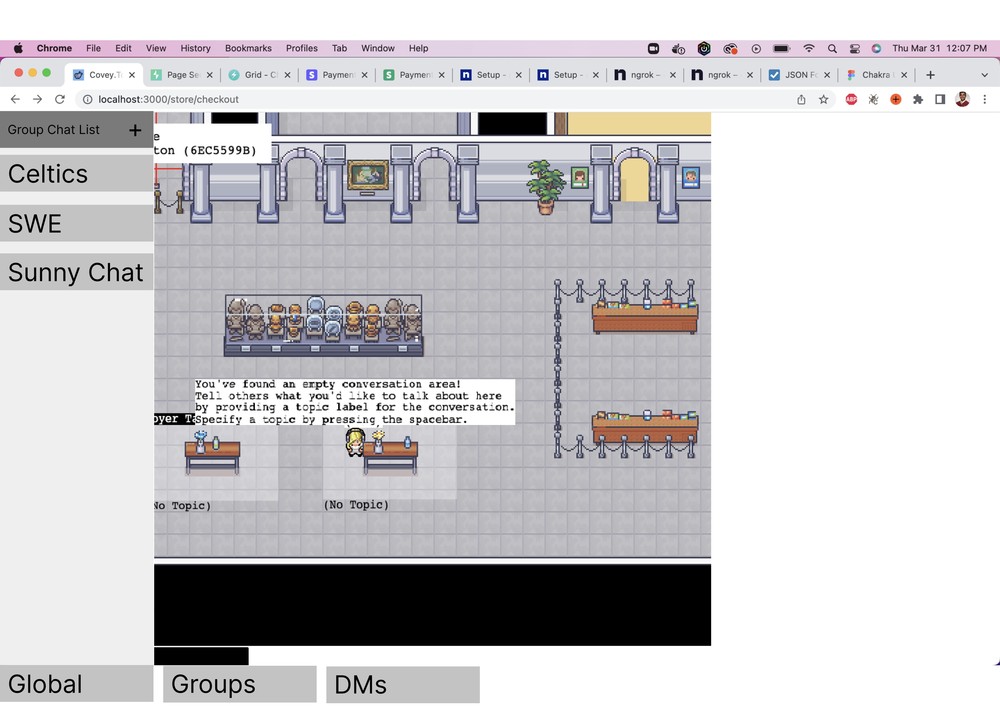
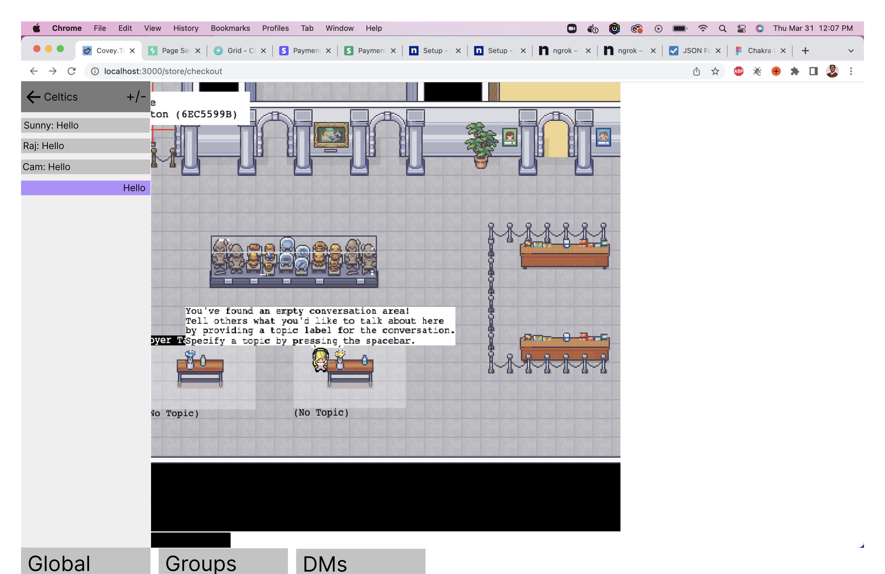
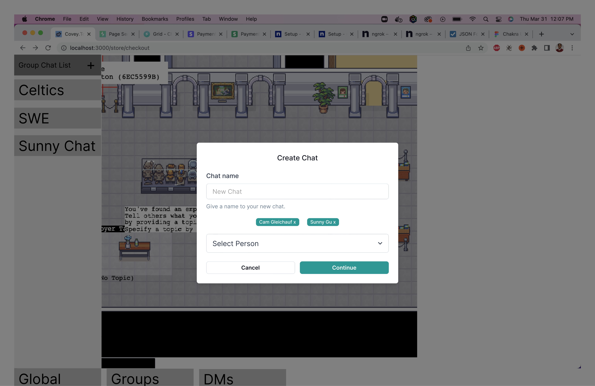
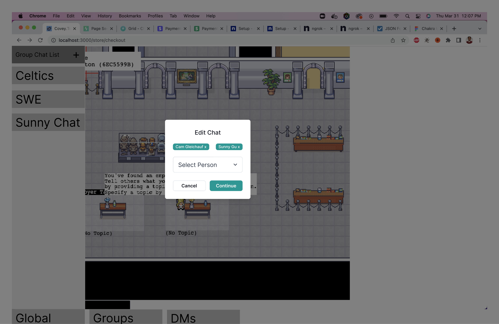

# Covey.Town Frontend App

Please see the `README.md` in the repository base for information about this project.

This frontend is created using the [create react app](https://create-react-app.dev) toolchain. You
can start a development server by running `npm start`. To create a production build, run
`npm run build`.

# Chat Design

Mock of Chat List 

Mock of Chat Window 

Mock of Creating a Chat 

Mock of Editing a Chat 
